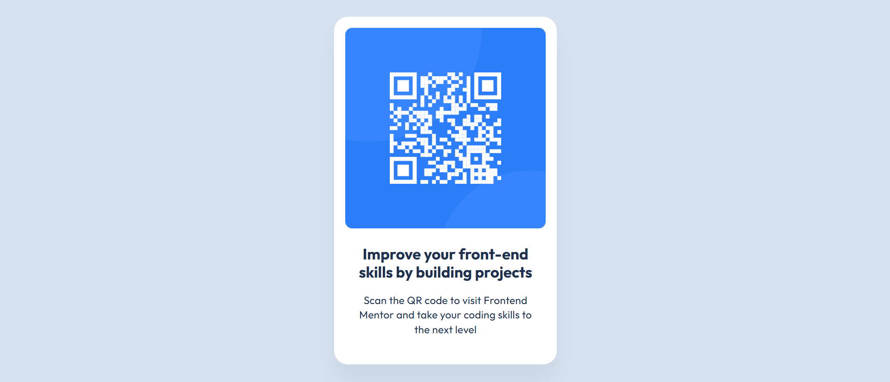

# Frontend Mentor - QR code component solution

This is a solution to the [QR code component challenge on Frontend Mentor](https://www.frontendmentor.io/challenges/qr-code-component-iux_sIO_H).

## Table of contents

- [Overview](#overview)
  - [Screenshot](#screenshot)
  - [Links](#links)
- [My process](#my-process)
  - [Built with](#built-with)
  - [What I learned](#what-i-learned)
  - [Continued development](#continued-development)
  - [Useful resources](#useful-resources)
- [Author](#author)
- [Acknowledgments](#acknowledgments)

## Overview

### Screenshot



### Links

- Solution URL: [Add solution URL here](https://your-solution-url.com)
- Live Site URL: [Add live site URL here](https://your-live-site-url.com)

## My process

### Built with

- Semantic HTML5 markup
- CSS custom properties
- Flexbox

### What I learned

I study how to make a good, clear code with HTML dan CSS. How to make a websiite with precision

To see how you can add code snippets, see below:

```html
<h1>Some HTML code I'm proud of</h1>
```
```css
.proud-of-this-css {
  color: papayawhip;
}
```
```js
const proudOfThisFunc = () => {
  console.log('🎉')
}
```

If you want more help with writing markdown, we'd recommend checking out [The Markdown Guide](https://www.markdownguide.org/) to learn more.

### Continued development

I will next to tailwind css. Before that, I will more practice how to make a clear code like profesional, because i think if the fundamental (html, css, js) is mastered, it will easier to I study framework. And I don't too rely on framework.

### Useful resources

- [Example resource 1](https://www.w3schools.com/) - This helped me for reference syntax.

**Note: Delete this note and replace the list above with resources that helped you during the challenge. These could come in handy for anyone viewing your solution or for yourself when you look back on this project in the future.**

## Author

- Website - Mohammad Wenning Ghalih(https://ghalihbageur.github.io/My-Portofolio/)
- Frontend Mentor - [@ghalihbageur](https://www.frontendmentor.io/profile/ghalihbageur)

## Acknowledgments

I suggest you to study with practice, feel free to open documentation if you forget a syntax
